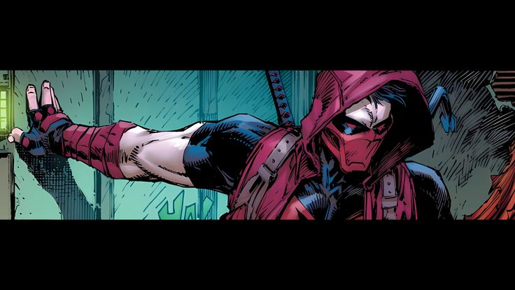

<!-- Header Image -->

  

<!-- Red Wave Banner -->

  

<!-- Typing Animation -->

  

---

## About Me

Hi! I’m **Sarah Aisyah**, a Data Science student who enjoys working with data, machine learning, databases, and creative technology.

I like building projects that combine **logic, design, and storytelling**.  
For me, data is not just numbers. It is evidence, patterns, and sometimes a little chaos waiting to be understood.

---

## Current Focus

- Exploring **Machine Learning** and **Artificial Intelligence**
- Building projects with **Python, SQL, and cloud databases**
- Learning more about **Computer Vision**
- Improving skills in **Data Visualization**
- Combining **technical analysis** with clean and attractive design

---

## Tech Stack

  

---

## Tools & Skills

| Category | Skills |
|---|---|
| Programming | Python, Java, SQL, JavaScript |
| Data Science | Pandas, NumPy, Matplotlib, Scikit-learn |
| Machine Learning | Classification, Sentiment Analysis, Recommendation System |
| Database | MySQL, PostgreSQL, MongoDB, Supabase |
| Design | Figma, UI/UX, Product Design |
| Tools | Git, GitHub, Google Colab, WSL, VS Code |

---

## Featured Projects

### Movie Recommendation System

A movie recommendation app using IMDb data and machine learning to recommend movies based on user mood and preferences.

### UMKM Database System

A cloud database project using PostgreSQL and Supabase to manage and analyze UMKM data in Desa Banjarsari.

### News Crawler & Sentiment Analysis

A Python-based news and social media crawling project for analyzing public awareness and sentiment on critical minerals in Indonesia.

---

## Highlight

  

---

## Connect With Me

  
  
  

---

  

  <i>"Data is not just numbers. It is a story waiting to be discovered."</i>

<!-- Footer -->

  

